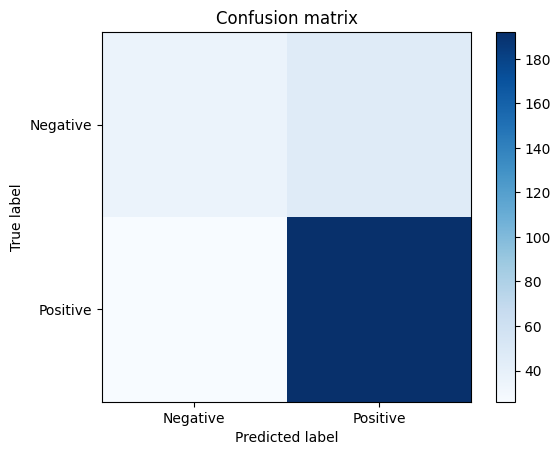
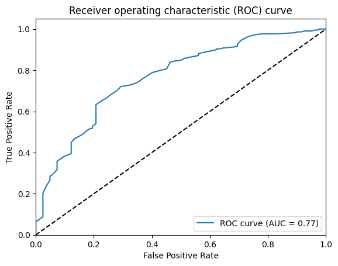

# Credit classification using random forest classification
**DISCLAIMER - This project is for personal learning and should not be used as a guide**

## **Goals:**
- Use one-hot encoding to make data set strictly numerical.
- Implement random forest classification.
- Use cross validation to optimize hyper parameters.
- Evaluate model

For this classification project i used the [Open ML dataset "credit-g"](https://www.openml.org/search?type=data&sort=runs&status=active&id=31). The data contained both numerical and categorical data, the categorical data was encoded using one-hot encoding to get numerical values for all features.

scikit learns implementation of the [RandomForestClassifier](https://scikit-learn.org/stable/modules/generated/sklearn.ensemble.RandomForestClassifier.html) was used for this project. The implementation is easy to use and have very handy methods for evaluation and change for model parameters.

The dataset was split into a training and test set using a 70 to 30 percent split.

scikit learns [GridSearchCV](https://scikit-learn.org/stable/modules/generated/sklearn.model_selection.GridSearchCV.html) was then using for hyperparameter tuning of the model, this method is exhaustive thus not very efficient but very easy to implement. 

The best model got a accuracy of 0.746 on the test set.

To visualize the performance of the model the confusion matrix and ROC+AUC was plotted and can be seen below.

For such as impactful classification such as credit one would not seattle for a model with such poor performance. For for the sake of this learning project i am satisfied with this result and deem all goals met.